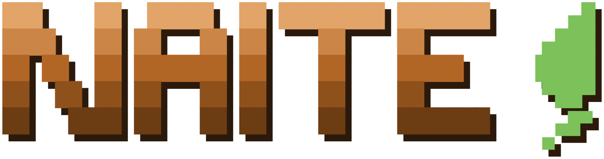

<p align="center">
  
</p>

<p align="center"><em>A personal knowledge system you own — a shared brain for your AI agents.</em></p>

<p align="center">
  
  
  
  
  
</p>

naite 는 내가 아는 것을 평문 Markdown 으로 쌓아 두는 개인용 지식 시스템입니다. 일을 대신 처리하는 도구가 아니라, 내 지식을 모아 두고 관리하는 곳입니다. 자료를 넣고 질문하면, 유지 관리자 역할을 맡은 LLM 에이전트(Claude Code·Codex)가 그것을 읽고 서로 연결된 페이지로 정리합니다.

넣는 자료는 AI 와 나눈 대화만이 아닙니다. 강의 자료, 유튜브 영상, 뉴스, 논문, 발표, 데이터 분석, 프로젝트 — 내 지식이 될 만한 건 무엇이든 기록할 수 있습니다.

특히 AI 와 나눈 대화와 거기 쌓인 메모리는 보통 그 서비스 안에 갇혀 있습니다. naite 에서는 그것을 끄집어내 Markdown 으로 내가 온전히 소유합니다. 어떤 AI 서비스에도 묶이지 않고, 전부 내 Git 저장소 안에 평문으로 남습니다.

한 번 쌓아 두면, 이 폴더에서 여는 어떤 에이전트든 나를 아는 채로 대화를 시작합니다. 예를 들어 관심 있는 채용 공고를 하나 던지면, 일반론이 아니라 — 내가 어떤 과목을 들었고 어떤 프로젝트를 했고 어떤 성과가 있었는지를 근거로 — 이 자리에 무엇이 준비돼 있고 무엇이 비어 있는지 짚어 줍니다. 에이전트를 바꿔도, 세션이 끝나도 같은 기록 위에서 이어집니다. 말하자면 내 에이전트들이 함께 쓰는 두뇌입니다.

이름은 나이테에서 왔습니다. 나무가 해마다 안쪽부터 테를 더하듯, 기록도 지우고 덮어쓰는 게 아니라 안쪽에 쌓이며 자랍니다.

이 아이디어는 Andrej Karpathy 가 내놓은 **LLM Wiki** 패턴 위에 있습니다. LLM 을 유지 관리자로 두고, 구조화되고 서로 링크된 Markdown 으로 개인 지식 저장소를 점진적으로 짓는다는 생각입니다. 고정된 형식이 아니라, 각자에게 맞게 길들이는 틀입니다.

## 어떻게 동작하나

naite 는 결국 Markdown 파일이 담긴 폴더 하나입니다. 세 겹으로 나뉩니다.

- **원본 자료** — 강의·논문·영상·뉴스·발표·데이터 분석·프로젝트·AI 대화 기록처럼 밖에서 들어온 것 (`roots/`)
- **지식 페이지** — 에이전트가 원본에서 추려 서로 연결해 둔, 내가 읽는 페이지 (`tree/`)
- **구조** — 이 페이지들을 묶고 잇는 약한 스키마 (`.naite/`, 평소엔 몰라도 됩니다)

예전 같으면 벡터 DB 가 필요했지만, 개인이 벡터 DB 를 관리하기는 어렵습니다. 평문 Markdown 이면 비슷한 효과를 내면서 가볍고(전부 합쳐도 보통 1MB 가 안 됩니다), Git 으로 그대로 공유할 수 있습니다.

전체 흐름은 나무 한 그루로 그려집니다. 여러 비유를 써 봤지만 이게 가장 직관적이었습니다.

| 나무 | 실제로는 | 위치 |
|---|---|---|
| 뿌리 | 원본 자료가 들어오는 곳 | `roots/` |
| 줄기 | 전체 구조를 보여주는 진입점 | `tree/trunk.md` |
| 잎 | 이해가 정리된 지식 페이지 | `tree/*.md` |
| 열매 | 프로젝트·결정·인사이트처럼 다시 꺼내 쓰는 결과물 | `kind=decision` 페이지 |
| 나이테 | 시간순 성장 기록 | `tree/rings.md` |
| 씨앗 | 앞으로 만들 페이지 후보 | `tree/seeds.md` |

자료가 뿌리로 들어오면 줄기에서 구조가 뻗고, 거기에 잎(페이지)이 달리고, 프로젝트와 결정이 열매로 맺힙니다. 잎과 잎은 맥(`[[wikilink]]`)으로 이어집니다. 페이지를 쓰고 잇는 일은 에이전트가 맡고, 나는 자료를 고르고 질문하고 중요한 것을 짚기만 하면 됩니다.

쓰는 동안엔 이 폴더를 Obsidian 으로 열면 나무가 그래프로 보이고, naite 앱에서도 볼 수 있습니다.

## 설치

필요한 것은 GitHub 계정과 Claude Code 하나입니다. Codex 를 쓰거나 직접 설치하려면 아래 폴백 경로를 따릅니다.

### Claude Code 플러그인 (권장)

Claude Code 에서 두 명령을 순서대로 실행합니다.

```text
/plugin marketplace add daehyeonxyz/naite-personal-memory
/plugin install naite
```

naite 하네스와 함께 `naite-mcp` 서버도 자동으로 등록됩니다. vault 는 에이전트가 연 프로젝트 폴더가 됩니다.

설치하면 `/naite start` 로 첫 세션을 시작하세요. 이미 다른 AI 에 쌓아 둔 대화 기록을 가져와 첫 나무를 짓는 1회성 안내 세션입니다.

```text
/naite start
```

ChatGPT·Gemini 같은 데서 대화 기록을 내보내 붙여넣으면, naite 가 그것을 가져와 잎과 맥과 열매로 짜서 첫 나무를 만듭니다. 데모용 예시가 아니라 내 기록이라, 첫 세션부터 바로 쓸모가 있습니다.

### 직접 설치 (Codex·수동 클론)

플러그인 마켓플레이스를 쓸 수 없으면(Codex 사용자, 직접 클론 선호) 아래 방법을 씁니다. 개인 기록이 담기니 **Private** 저장소를 권장합니다.

1. GitHub 에서 새 저장소를 만들고, 클론한 폴더에서 에이전트를 실행합니다.
2. 아래 프롬프트를 그대로 붙여넣습니다.

```text
https://github.com/daehyeonxyz/naite-personal-memory 를 이 폴더에 설치해줘.

1. 위 저장소를 임시 폴더에 클론한 다음, .git 을 제외한 모든 파일을 이 폴더 루트로 복사해.
2. 복사가 끝나면 임시 폴더를 지우고, CLAUDE.md (Codex 라면 AGENTS.md) 를 읽어.
3. "naite install" 메시지로 첫 커밋을 만들어줘.
4. 끝나면 내가 지금 바로 해볼 수 있는 것을 한두 가지 알려줘.
```

설치가 끝나면 `/naite start` 로 첫 세션을 시작하세요. 처음부터 모든 걸 정리할 필요는 없습니다. 나무는 자랄수록 쓸모가 커집니다.

### 데스크톱 앱 (보기 전용)

나무를 보고·찾고·에이전트에게 일을 맡기는 GUI 입니다. 쓰는 도구가 아니라 뷰어라, 잎과 맥과 열매를 한눈에 펼쳐 보여 줍니다. 하네스와 같은 버전으로 함께 움직입니다.

[최신 릴리스](https://github.com/daehyeonxyz/naite-app-releases/releases/latest)에서 내려받습니다.

- Windows — `naite_*_x64-setup.exe`
- macOS — `naite_*_universal.dmg` (Intel·Apple Silicon)
- Linux — `naite_*_amd64.AppImage`

설치하면 새 버전이 나올 때 앱이 알아서 업데이트합니다.

## 명령어

| 명령 | 언제 쓰나 |
|---|---|
| `/naite start` | 처음 시작할 때. 다른 AI 의 기록을 가져와 첫 나무를 짓는 1회성 안내 |
| `/naite grow [path?]` | 공부한 것, 던져 둔 자료를 나무에 반영할 때. 대화 마무리·파일 하나·과목 단위까지 전부 |
| `/naite grow backfill <slug>` | 이미 학습이 끝난 과목·아카이브를 대화 없이 chapter 단위로 일괄 보강할 때 |
| `/naite ask <질문>` | 쌓인 기록을 바탕으로 물을 때 |
| `/naite fruit [topic?]` | 결정·trade-off·실패 분석을 열매로 남길 때 |
| `/naite care --check [scope?]` | 고치지 않고 건강 점검만 할 때. secrets scan 과 schema/lint 보고서를 만든다 |
| `/naite care [scope?]` | 점검 결과나 사용자의 요청을 바탕으로 나무를 실제로 다듬을 때 |
| `/naite upgrade` | naite 새 버전이 나왔을 때. 내 자료와 내가 고친 규칙은 보존하고, 필요한 schema migration은 preview와 승인 뒤 적용 |

명령을 외울 필요는 없습니다. 자료를 붙여넣고 "반영해줘" 라고만 해도 에이전트가 알맞은 흐름을 찾아갑니다.

`capture.md`, `ingest.md`, `grow-branch.md`, `care-check.md` 는 사용자가 직접 부르는 명령이 아니라 위 명령들이 내부에서 읽는 절차 파일입니다. 예를 들어 대화 내용을 남기면 `/naite grow` 가 먼저 `capture.md` 로 `roots/conversations/` 에 임시 기록을 만들고, 사용자가 승인하면 `ingest.md` 로 `tree/` 에 반영합니다. `grow-backfill.md` 도 파일 이름은 별도지만 진입점은 `/naite grow backfill <slug>` 입니다.

## 폴더 구조

알아야 할 폴더는 둘뿐입니다.

```text
naite/
  roots/   # 뿌리. 원본 자료가 들어오는 곳 (강의·논문·영상·뉴스·발표·데이터 분석·프로젝트·AI 대화 기록)
  tree/    # 나무. 에이전트가 쓰고 서로 잇는 지식 페이지
  docs/    # 더 깊은 규칙이 궁금할 때 읽는 기술 문서
```

나머지(`.naite/`, `.claude/`, `.agents/`)는 에이전트가 쓰는 내부 구현이라 몰라도 됩니다.

## 에이전트를 나에게 맞추기

naite 는 셋으로 나를 압니다. 모두 평범한 Markdown 이라 직접 손볼 수 있습니다.

- `SOUL.md` — 에이전트의 정체성과 말투. 기본값이 있고, 톤을 바꾸려면 이 파일을 고칩니다.
- `USER.md` — 나의 응답 선호(어떤 톤·길이로 답할지). 비워 두고 시작해도 되고, `/naite start` 가 동의를 받아 채웁니다.
- `MEMORY.md` — 진행 중인 작업과 운영 메모.

`SOUL.md` 는 공개 기본값이라 함께 쓰지만, `USER.md` 와 `MEMORY.md` 는 개인 정보라 Git 에 올리지 않습니다.

## 더 알아보기

- [docs/ARCHITECTURE.md](docs/ARCHITECTURE.md) — 왜 이런 구조인지, 스키마 설계 근거
- [docs/CONVENTIONS.md](docs/CONVENTIONS.md) — 페이지가 지키는 규칙
- [docs/CONTEXT.md](docs/CONTEXT.md) — 에이전트가 무엇을 어떤 순서로 읽는지
- [docs/agent-runtimes.md](docs/agent-runtimes.md) — Claude Code, Codex, plugin, prompt caching 차이

## 기여

naite 하네스(스킬·문서·스크립트·플러그인 설정)는 공개돼 있고 기여를 환영합니다. fork 해서 고친 뒤 PR 을 보내면 메인테이너가 검토해 반영합니다. 다만 `tree/` 와 `roots/` 는 각자의 개인 기록이라 기여 대상이 아닙니다. 자세한 흐름과 스키마 변경 규칙은 [CONTRIBUTING.md](CONTRIBUTING.md) 에 있습니다.

## License

MIT
