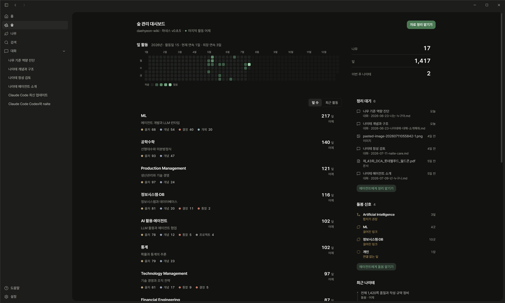
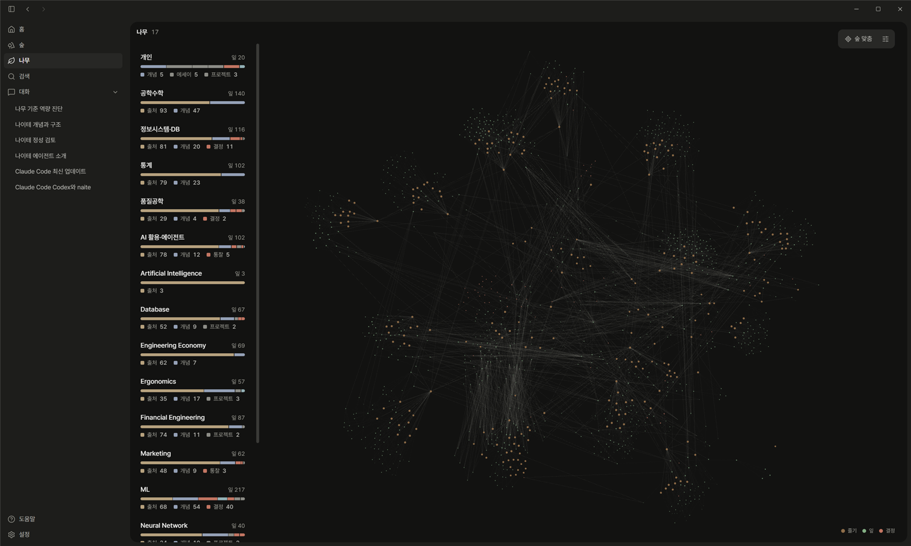
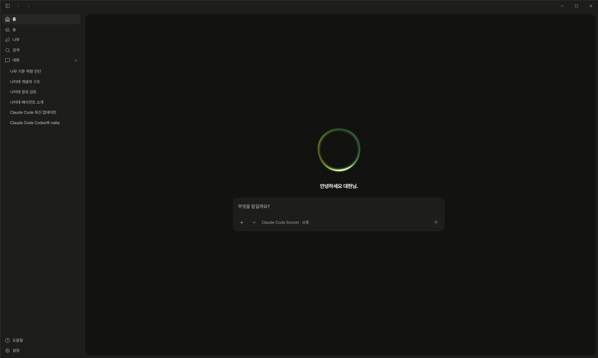

<p align="center">
  
</p>

<p align="center"><em>매일의 대화와 배움이 겹겹이 쌓이는 나의 지식 나무</em></p>

<p align="center">
  
  
  
  
  
</p>

우리는 매일 AI와 대화하며 배우고, 고민하고, 결정합니다. 그런데 그 대화는 세션이 끝나면 흩어지고, 서비스마다 따로 갇혀 있습니다. 나에 대해 가장 잘 아는 기록인데, 정작 내 것이 아닙니다.

naite는 그 기록을 여러분의 것으로 만듭니다. 자료를 넣고 질문을 던지면 에이전트가 읽고 정리해서, 서로 연결된 지식 페이지로 쌓아 둡니다. 전부 평문 Markdown이라 어떤 서비스에도 묶이지 않고, 여러분의 Git 저장소 안에 남습니다. 이 폴더를 vault라고 부릅니다.

재료는 AI와 나눈 대화만이 아닙니다. 강의 자료, 유튜브 영상, 논문, 뉴스, 프로젝트 기록까지, 내 지식이 될 만한 것이라면 무엇이든 넣을 수 있습니다.

이렇게 쌓인 vault를 여는 에이전트는 처음부터 나를 아는 채로 대화를 시작합니다. 채용 공고를 하나 던지면 일반적인 조언 대신, 내가 배운 것과 만들어 온 것을 근거로 무엇이 준비되었고 무엇이 부족한지 짚어 줍니다. 에이전트를 바꿔도, 세션이 끝나도, 같은 기록 위에서 이어집니다.

이름은 나무의 나이테에서 왔습니다. 나무가 해마다 안쪽부터 테를 더하며 자라듯, 여러분의 기록도 덮어쓰이지 않고 겹겹이 쌓이며 자랍니다.

<p align="center">
  
</p>
<p align="center"><em>데스크톱 앱에서 본 숲입니다. 지식이 얼마나 쌓였고 지금 어디가 자라는 중인지 한눈에 보여 줍니다.</em></p>

## 나무 한 그루

vault는 나무 한 그루입니다.

여러분이 넣은 자료는 뿌리에 쌓입니다. 에이전트가 그것을 읽고 정리한 지식 페이지가 잎이고, 잎과 잎은 맥으로 이어져 서로를 설명합니다. 고민 끝에 내린 결정은 열매로 남고, 이 모든 성장은 나이테에 시간순으로 기록됩니다.

폴더로 보면 이렇게 단순합니다.

```text
vault/
  roots/   # 뿌리. 내가 넣은 원본 자료
  tree/    # 나무. 에이전트가 정리하고 이어 둔 지식 페이지
```

여러분이 할 일은 자료를 고르고 질문하는 것뿐입니다. 쓰고, 잇고, 다듬는 일은 에이전트의 몫입니다. 벡터 DB 같은 무거운 장치도 없습니다. 평문 Markdown이라 가볍고, Git으로 그대로 옮기거나 공유할 수 있으며, Obsidian으로 열면 나무가 그래프로 보입니다.

## 시작하기

Claude Code만 있으면 됩니다. vault로 쓸 폴더를 하나 만들어 Claude Code를 열고, 아래 한 줄을 붙여넣으세요.

```text
naite 를 설치하고 이 폴더를 내 vault 로 시작해줘. `claude plugin marketplace add daehyeonxyz/naite-personal-memory` 와 `claude plugin install naite@naite` 를 실행한 뒤, 설치된 naite 플러그인의 start 절차를 읽고 그대로 따라줘.
```

나머지는 에이전트가 이어서 진행합니다.

1. naite 플러그인을 설치합니다.
2. 이 폴더가 여러분의 vault가 됩니다.
3. 첫 나무 심기를 안내합니다. ChatGPT, Claude, Gemini에서 내보낸 대화 기록을 첨부하면 붙여넣은 정보를 바탕으로 나와 관련된 페이지들이 바로 나이테에 기록됩니다.

이렇게 스스로에 대한 정보를 기록하고, 기록된 정보를 바탕으로 새로운 학습을 해 나갈수록 여러분의 나이테는 더 겹겹이 쌓일 것입니다. 다음부터는 어디서든 `/naite`로 시작하면 됩니다.

<details>
<summary>명령을 직접 치고 싶다면</summary>

```text
/plugin marketplace add daehyeonxyz/naite-personal-memory
/plugin install naite
```

설치한 뒤 vault 폴더에서 `/naite start`를 실행하세요.

</details>

### 이미 vault가 있다면

`~/.naite/root` 파일에 vault 경로를 한 줄 적어 두세요. 그다음부터는 어느 폴더에서 열어도 `/naite`가 여러분의 vault로 연결됩니다.

### Codex를 쓰거나 직접 설치하려면

플러그인 없이 저장소를 직접 복사해 시작할 수도 있습니다. 개인 기록이 담기므로 Private 저장소를 권장합니다. 새 저장소를 만들어 클론한 폴더에서 에이전트를 열고, 아래를 붙여넣으세요.

```text
https://github.com/daehyeonxyz/naite-personal-memory 를 이 폴더에 설치해줘.

1. 위 저장소를 임시 폴더에 클론한 다음, .git 을 제외한 모든 파일을 이 폴더 루트로 복사해.
2. 복사가 끝나면 임시 폴더를 지우고, `.naite/PUBLIC_STARTER` 파일이 있으면 지워. 그다음 CLAUDE.md (Codex 라면 AGENTS.md) 를 읽어.
3. `git config core.hooksPath .naite/hooks` 로 가드 훅을 켜.
4. "naite install" 메시지로 첫 커밋을 만들어줘.
5. 끝나면 내가 지금 바로 해볼 수 있는 것을 한두 가지 알려줘.
```

가드 훅은 비밀키나 개인정보가 실수로 커밋되는 것을 막아 주는 안전장치입니다.

## 이렇게 씁니다

따로 배울 것은 없습니다. 평소처럼 에이전트와 대화하다가, 남기고 싶은 순간에 부르면 됩니다.

- 공부를 마쳤거나 좋은 자료를 만났을 때, 붙여넣고 "반영해줘"라고 하면 나무에 기록됩니다. (`/naite grow`)
- 예전에 공부했던 자료들을 한번에 노트로 정리하고 싶을 때는 `/naite grow backfill`을 씁니다.
- 궁금한 것이 생기면 쌓인 기록을 근거로 답을 받습니다. (`/naite ask`)
- 결정이나 고민의 결론을 남기고 싶을 때는 열매로 맺어 둡니다. (`/naite fruit`)
- 나무가 무성해지면 상태를 점검하고 다듬습니다. (`/naite care`)
- 새 버전이 업데이트되면 `/naite upgrade` 한 번이면 됩니다.

명령을 외울 필요는 없습니다. "반영해줘", "정리해줘", "이거 기억해?"처럼 말하면 에이전트가 알맞은 흐름을 찾아갑니다.

## 데스크톱 앱

쌓인 나무를 눈으로 보고 싶을 때는 데스크톱 앱을 엽니다. 나무를 보고, 찾고, 에이전트에게 일을 맡길 수 있습니다.

<p align="center">
  
</p>
<p align="center"><em>여러 페이지가 어떤 관계로 이어져 있는지를 그래프뷰로 볼 수 있습니다.</em></p>

<p align="center">
  
</p>
<p align="center"><em>쌓인 지식을 아는 에이전트에게 무엇이든 맡길 수 있습니다.</em></p>

[최신 릴리스](https://github.com/daehyeonxyz/naite-app-releases/releases/latest)에서 내려받으세요. 설치만 하면, 새 버전은 자동으로 업데이트됩니다.

- Windows: `naite_*_x64-setup.exe`
- macOS: `naite_*_universal.dmg`
- Linux: `naite_*_amd64.AppImage`

## 나를 기억하는 파일들

세 파일이 나를 기억합니다. 모두 평범한 Markdown이라 언제든 직접 고칠 수 있습니다.

- `SOUL.md`: 에이전트의 말투. 톤을 바꾸고 싶으면 이 파일을 고칩니다.
- `USER.md`: 내가 선호하는 답변 방식. 비워 두고 시작해도 됩니다.
- `MEMORY.md`: 진행 중인 작업 메모.

`USER.md`와 `MEMORY.md`는 개인 정보라 Git에 올라가지 않습니다.

### 다른 컴퓨터로 옮길 때

vault는 Git 저장소라 clone 하면 그대로 옮겨집니다. 새 컴퓨터에서 두 가지만 챙기세요.

1. 새 폴더에서 `git config core.hooksPath .naite/hooks`를 한 번 실행해 가드 훅을 다시 켭니다.
2. `USER.md`와 `MEMORY.md`는 Git에 없으니 예전 폴더에서 직접 복사합니다.

## 더 알아보기

- [docs/ARCHITECTURE.md](docs/ARCHITECTURE.md): 왜 이런 구조인지
- [docs/CONVENTIONS.md](docs/CONVENTIONS.md): 페이지가 지키는 규칙
- [docs/CONTEXT.md](docs/CONTEXT.md): 에이전트가 무엇을 읽는지
- [docs/connect-mcp.md](docs/connect-mcp.md): Claude Desktop과 Codex에 MCP로 붙이기

## 기여

naite 하네스는 공개되어 있고 기여를 환영합니다. fork 해서 고친 뒤 PR을 보내 주세요. `tree/`와 `roots/`는 각자의 개인 기록이라 기여 대상이 아닙니다. 자세한 내용은 [CONTRIBUTING.md](CONTRIBUTING.md)에 있습니다.

## License

MIT
